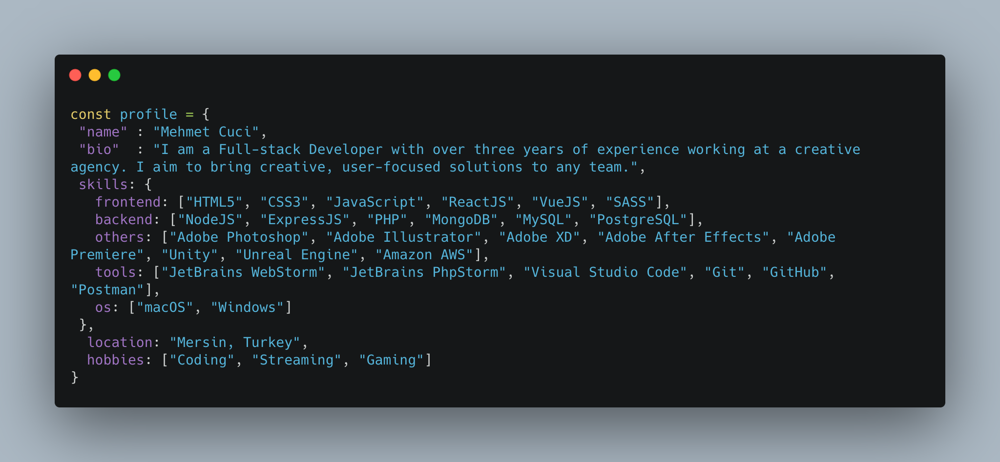

### Hi there 👋

<!--
**mehmetcuci/mehmetcuci** is a ✨ _special_ ✨ repository because its `README.md` (this file) appears on your GitHub profile.

Here are some ideas to get you started:

- 🔭 I’m currently working on ...
- 🌱 I’m currently learning ...
- 👯 I’m looking to collaborate on ...
- 🤔 I’m looking for help with ...
- 💬 Ask me about ...
- 📫 How to reach me: ...
- 😄 Pronouns: ...
- ⚡ Fun fact: ...
-->

<h2>I'am Mehmet Cuci! 👋</h2>

 

 
 

### 🛠 &nbsp;Tech Stack

#### &nbsp; Frontend
&nbsp;
&nbsp;
&nbsp;
&nbsp;
&nbsp;
&nbsp;
&nbsp;

#### &nbsp; Backend
&nbsp;
&nbsp;
&nbsp;

#### &nbsp; Tools
&nbsp;
&nbsp;
&nbsp;
&nbsp;
&nbsp;
&nbsp;
&nbsp;
&nbsp;
&nbsp;
&nbsp;
&nbsp;

#### &nbsp; Other
&nbsp;
&nbsp;
&nbsp;
&nbsp;
&nbsp;
&nbsp;

